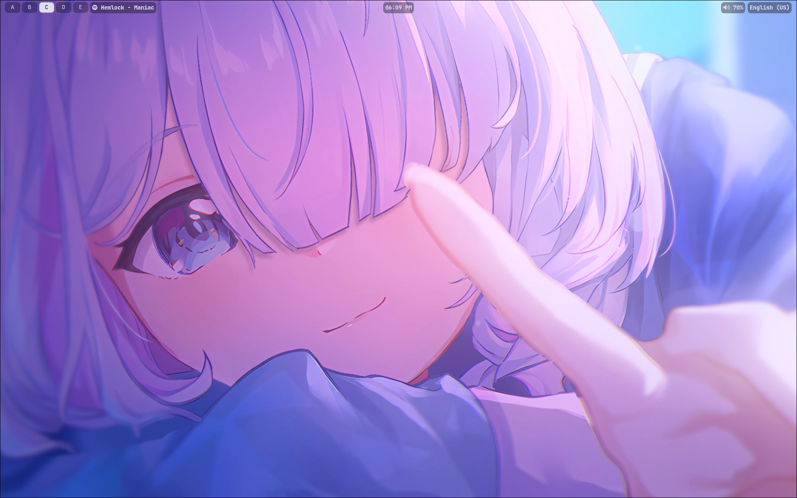
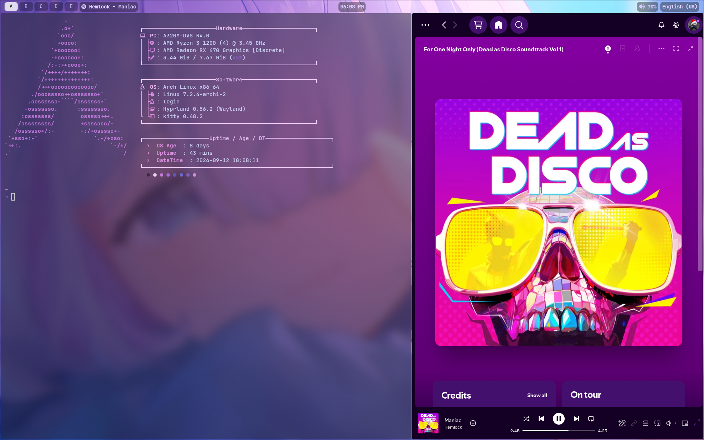
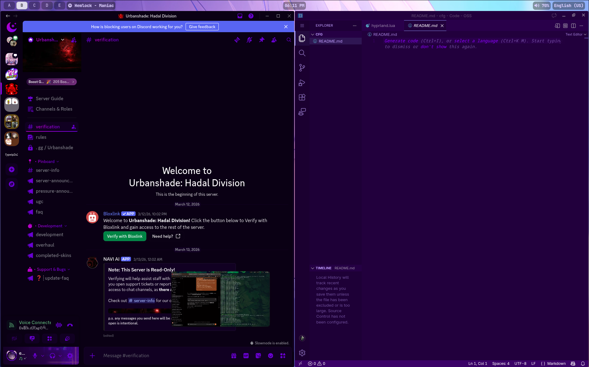

# Purple-Hypr-Rise

My personal Hyprland configuration for Arch Linux.

A minimal and clean setup focused on customization, simplicity and a comfortable workflow. Nothing too bloated — just the stuff I actually use.

## Screenshots







## Installation

Clone the repository:

```bash
git clone https://github.com/Fillos-A98/Purple-Hypr-Rise.git
cd Purple-Hypr-Rise
```

Copy the configuration files to your home directory:

```bash
cp -r config/* ~/.config/
cp .zshrc ~/.zshrc
```

If the repository contains system configuration files, copy them manually to the appropriate locations.

After that, log into Hyprland and adjust anything you want.

> This repository does not include an automatic installation script. The configuration is intentionally meant to be installed and adapted manually.

## Modules & Components

The setup currently uses:

* Hyprland
* Waybar
* Kitty
* Zsh
* Fastfetch
* Hyprlauncher
* Hyprtoolkit
* Rofi
* Cava
* Playerctl
* Grimblast
* Swappy
* Cliphist
* Qt6ct
* mpvpaper

Some components are optional and can be removed if you don't need them.

## Login Manager

This configuration does not depend on a specific login manager.

Hyprland can be started from a TTY or through a login manager depending on how your system is configured.

### Wallpaper

The wallpaper used in the screenshots is available in the
[Releases](https://drive.google.com/drive/folders/1ubTPX-AHSEwgFKzmN4rK6RSA_vKdBR9p?usp=sharing)section.

## Customization

The configuration contains custom settings for:

* Hyprland animations
* Keybinds
* Waybar
* Cava
* Hyprlauncher
* Hyprtoolkit
* Wallpapers
* Cursor
* Colors
* Transparency
* Terminal
* Fastfetch
* Various scripts and utilities

The configuration uses a light, clean visual style with blue/purple accents.

## License

Copyright (c) 2026 Fillos-A98
